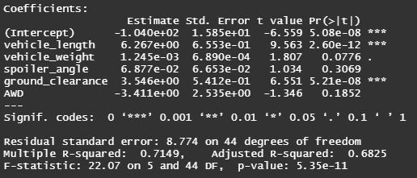
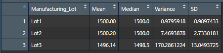
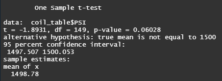
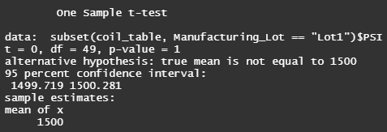
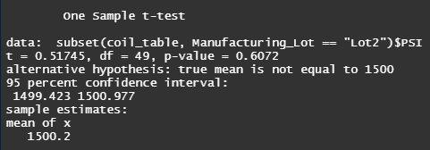
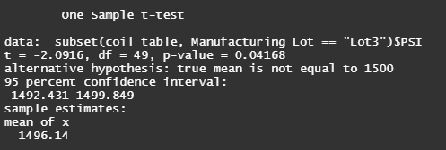

# MechaCar Statistical Analysis

## Linear Regression to Predict MPG
---

According to to the linear regression: vehicle length and ground clearance provide a non-random amount of variance to the MPG. The intercept provides a non-random amount of variance that can be intrinsic to the baseline design of the vehicle or accounting for other factors we are not adjusting within this linear regression. It can not be concluded that the slope of the lienar model is zero due to the non-random factors accounted for in this regression that have a statistically significant impact on MPG. While there are factors that have statistically significant impacts on MPG, the true amount can not be reliably predicted due to the low R-squared value of 0.71.

## Summary Statistics on Suspension Coils
---

The MechaCar suspension coils' dictate that the variance of the suspension coils must not exceed 100 psi. While accounting for all lots, the production of Lots 1-3 pass. However, looking further into splitting Lot 1, Lot 2, and Lot 3 we can determine that Lot 3 does not meet this specification while Lot 1 and Lot 2 are well under the variance requirement. 

## t-Tests
---

The t-test shown above is comparing the difference between the amount of pressure that suspension coils can take between the general population versus the MechaCar. Based on p > 0.05, we should fail to reject the null hypothesis meaning we are likely to believe that there is no statistically significant difference.

Looking at Lot 1 and 2 one sample t-tests, they follow a similar trend of not showing statistical significance. This changes however when looking at Lot 3.

As shown above the p-value of Lot 3 is less than 0.05 (p < 0.05) showing a statistical significance between the general population and lot 3's suspension coils' ability to handle pressure.

## Study Design: MechaCar vs. Competition
---
In a simple study design we are looking to compare how MechaCar performs versus its competition. There are many factors that could be compared however it would be more simplistic to compare something such as fuel efficiency.

###What metric or metrics are you going to test?
To compare vehicle performance between the MechaCar and cars of the same class, fuel efficiency will be tested.

###What is the null hypothesis or alternative hypothesis?
The null hypothesis will be that the difference in mean fuel efficiency will be negligible. The alternative hypothesis will be the difference in mean fuel efficiency with be statistically significant.

###What statistical test would you use to test the hypothesis? And why?
To compare against several different cars of the same class versus the MechaCar an appropriate statistical test would be an ANOVA test due to its ability to compare multiple samples when compared to a two or one sample t-test.

### What data is needed to run the statistical test?
The data required to run this test would be however many different cars of similar class to that of the MechaCar that we would want to compare and a sample size of at least 49 cars for each comparison. This data would include fuel efficiency data for cars of that model to be able to run a strong statistical comparison between the fuel efficiencies of the MechaCar and these competitor's models. 